# Dompet Syari'ah — Aplikasi E-Money Mobile

> Ujian Akhir Semester · Aplikasi Mobile Lanjutan

---

## Identitas Mahasiswa

|           |                             |
| --------- | --------------------------- |
| **Nama**  | MUHAMMAD ILHAM MAULANA      |
| **NIM**   | 1123150141                  |
| **Kelas** | TI 23 SH SE                 |
| **Email** | mhmmad13ilhammlna@gmail.com |

---

## Repository E-Commerce

**(https://github.com/IlhamMaulana13/UTSApps-MarketPlace.git/)**

---

## Deskripsi Aplikasi

**Dompet Syari'ah** adalah aplikasi e-money berbasis mobile yang dirancang khusus untuk ekosistem kampus. Aplikasi ini memungkinkan mahasiswa melakukan transaksi keuangan digital secara cepat, aman, dan efisien — mulai dari top up saldo, transfer antar pengguna, hingga pembayaran ke merchant menggunakan sistem deep link lintas aplikasi.

### Fitur Utama

| Fitur                   | Deskripsi                                                                           |
| ----------------------- | ----------------------------------------------------------------------------------- |
| **Autentikasi**         | Register, login, verifikasi email, dan 2FA (SMTP / TOTP / Notifikasi)               |
| **Top Up Saldo**        | Isi saldo dompet digital secara instan                                              |
| **Transfer**            | Kirim uang ke sesama pengguna Dompet Syari'ah                                       |
| **Pembayaran Merchant** | Bayar ke merchant via deep link (`dompetsyariah://pay?...`) dari aplikasi eksternal |
| **Riwayat Transaksi**   | Lihat seluruh histori transaksi dengan detail lengkap                               |
| **PIN Keamanan**        | Setiap transaksi dikonfirmasi menggunakan PIN 6 digit yang tersimpan aman           |
| **Halaman Sukses**      | Bukti transaksi dengan detail lengkap dan callback otomatis ke merchant             |
| **Notifikasi Push**     | Firebase Cloud Messaging untuk notifikasi transaksi real-time                       |

---

## Arsitektur Aplikasi

Aplikasi ini menggunakan **Clean Architecture** dengan pemisahan tiga lapisan utama, ditambah backend REST API terpisah berbasis Go.

```
┌─────────────────────────────────────────────────────┐
│                   FLUTTER APP                       │
│                                                     │
│  ┌─────────────┐  ┌──────────────┐  ┌───────────┐  │
│  │Presentation │  │   Domain     │  │   Data    │  │
│  │             │  │              │  │           │  │
│  │ • Pages     │  │ • Entities   │  │ • Models  │  │
│  │ • BLoCs     │  │ • UseCases   │  │ • Repos   │  │
│  │ • Widgets   │  │ • Repos(IF)  │  │ • Remote  │  │
│  └─────────────┘  └──────────────┘  │ • Local   │  │
│                                     └───────────┘  │
└─────────────────────────────────────────────────────┘
                        │ HTTP/REST
                        ▼
┌─────────────────────────────────────────────────────┐
│               GO BACKEND (REST API)                 │
│                                                     │
│  handlers/ · middleware/ · models/ · services/      │
│  PostgreSQL · Firebase Admin SDK · JWT Auth         │
│  VPS: 202.155.95.224:8082                           │
└─────────────────────────────────────────────────────┘
```

### Layer Detail

**Presentation Layer**

- `BLoC` (Business Logic Component) sebagai state management — `AuthBloc`, `PaymentBloc`, `AccountBloc`, `OtpBloc`
- `GoRouter` untuk navigasi deklaratif dengan deep link support
- Halaman: splash, auth (login/register/2FA), home, transfer, topup, payment, merchant, history, akun, success

**Domain Layer**

- Use cases terpisah per fitur: `auth/`, `account/`, `payment/`
- Interface repository (abstraksi dari implementasi data)
- Entities sebagai model bisnis murni

**Data Layer**

- `RemoteDataSource` — komunikasi ke backend via `Dio` HTTP client
- `LocalDataSource` — penyimpanan aman via `FlutterSecureStorage` (JWT token, PIN, user data)
- Repository implementations yang menggabungkan remote + local

**Backend (Go)**

- REST API dengan struktur: `handlers/` → `services/` → `models/`
- JWT middleware untuk autentikasi
- Firebase Admin SDK untuk push notification
- Mendukung `otp_type: "pin"` untuk validasi PIN dari Flutter

---

## Cara Menjalankan Proyek

### Prasyarat

- Flutter SDK `>=3.0.0`
- Dart SDK `>=3.0.0`
- Android SDK (min API 21)
- Go `>=1.21` (untuk backend)
- PostgreSQL (untuk database backend)

### 1. Clone Repository

```bash
git clone <url-repository>
cd E-MoneyUAS
```

### 2. Setup Flutter App

```bash
cd e-money

# Install dependencies
flutter pub get

# Pastikan device/emulator terhubung
flutter devices

# Jalankan aplikasi
flutter run
```

### 3. Build APK (Release)

```bash
cd e-money
flutter build apk --release
# APK tersedia di: build/app/outputs/flutter-apk/app-release.apk
```

### 4. Setup & Jalankan Backend (Opsional — sudah berjalan di VPS)

```bash
cd backend

# Copy environment variables
cp .env.example .env
# Edit .env: isi DB_URL, JWT_SECRET, Firebase credentials

# Dengan Docker
docker-compose up -d

# Atau manual
go mod tidy
go build -o app .
./app
```

> **Catatan:** Backend sudah berjalan di VPS `202.155.95.224:8082`. Untuk development lokal, ubah `baseUrl` di `e-money/lib/core/constants/app_constants.dart`.

---

## Daftar Dependensi Utama

### Flutter (Frontend)

| Package                  | Versi   | Fungsi                          |
| ------------------------ | ------- | ------------------------------- |
| `flutter_bloc`           | ^9.0.0  | State management (BLoC pattern) |
| `go_router`              | ^14.8.1 | Navigasi deklaratif & deep link |
| `dio`                    | ^5.7.0  | HTTP client untuk REST API      |
| `flutter_secure_storage` | ^9.2.2  | Penyimpanan aman (JWT, PIN)     |
| `firebase_messaging`     | ^15.2.4 | Push notification               |
| `firebase_auth`          | ^5.5.2  | Firebase authentication         |
| `google_sign_in`         | ^6.2.2  | Login dengan Google             |
| `mobile_scanner`         | ^7.0.0  | Scan QR code                    |
| `app_links`              | ^6.3.2  | Deep link handler               |
| `url_launcher`           | ^6.3.1  | Buka URL / callback ke merchant |
| `get_it`                 | ^8.0.2  | Dependency injection            |
| `equatable`              | ^2.0.5  | Perbandingan object BLoC states |
| `shared_preferences`     | ^2.3.4  | Preferensi lokal ringan         |
| `intl`                   | ^0.19.0 | Format angka & tanggal (Rupiah) |
| `shimmer`                | ^3.0.0  | Loading skeleton UI             |
| `cached_network_image`   | ^3.4.1  | Cache gambar dari network       |

### Backend (Go)

| Package             | Fungsi                       |
| ------------------- | ---------------------------- |
| `gin` / `net/http`  | HTTP router & server         |
| `golang-jwt/jwt`    | JWT authentication           |
| `lib/pq`            | PostgreSQL driver            |
| `firebase-admin-go` | Push notification & Firebase |

---

## Screenshot Aplikasi

> Screenshot diambil dari perangkat Android (OPPO CPH2217)

### Autentikasi & Onboarding

| Login                                                                       | Register                                                                       | Verifikasi 2FA                                                          |
| --------------------------------------------------------------------------- | ------------------------------------------------------------------------------ | ----------------------------------------------------------------------- |
| _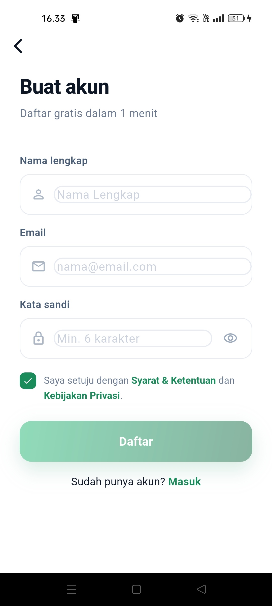_ | _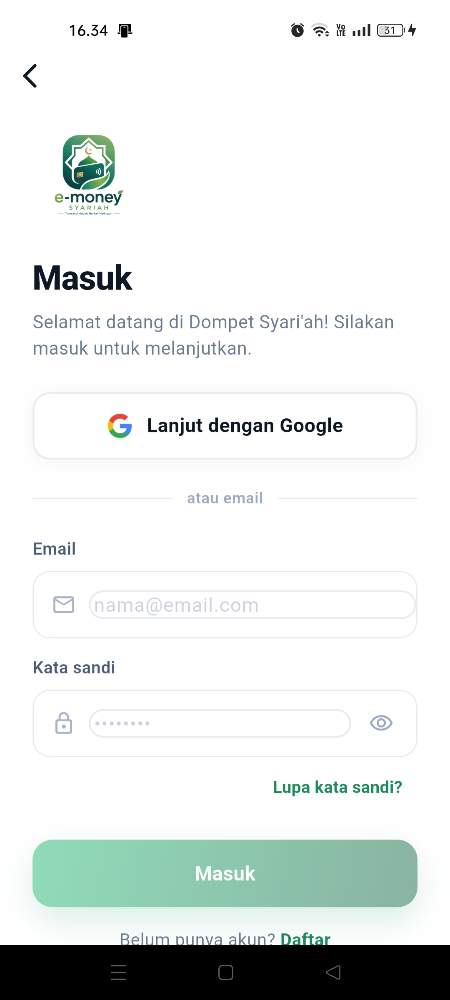_ | _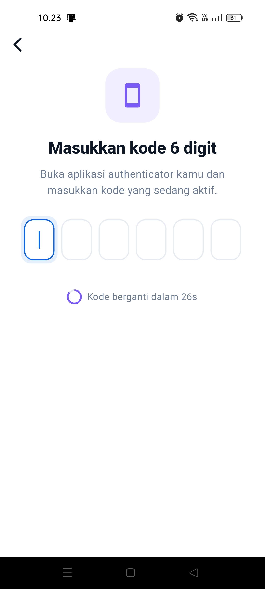_ |

### Fitur Utama

| Home                                                                      | Transfer                                                                          | Top Up                                                                      |
| ------------------------------------------------------------------------- | --------------------------------------------------------------------------------- | --------------------------------------------------------------------------- |
| _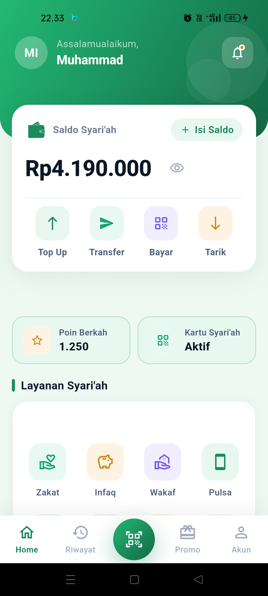_ | _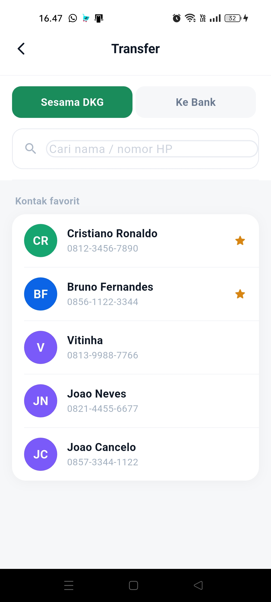_ | _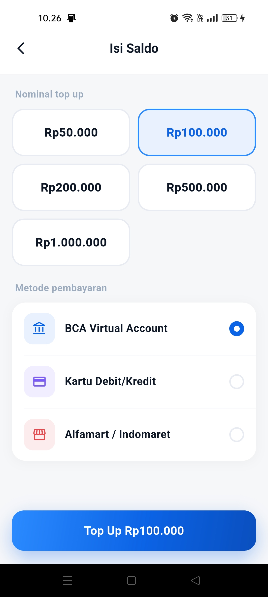_ |

| PIN Keamanan                                                                 | Pembayaran Merchant                                                                 | Halaman Sukses                                                                |
| ---------------------------------------------------------------------------- | ----------------------------------------------------------------------------------- | ----------------------------------------------------------------------------- |
| _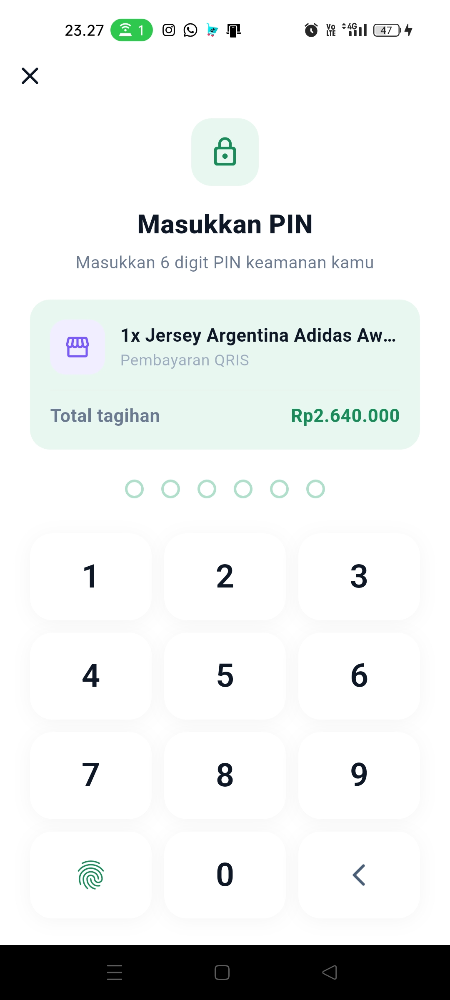_ | _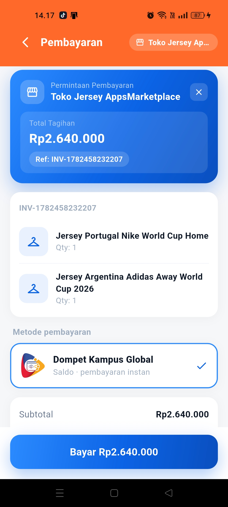_ | _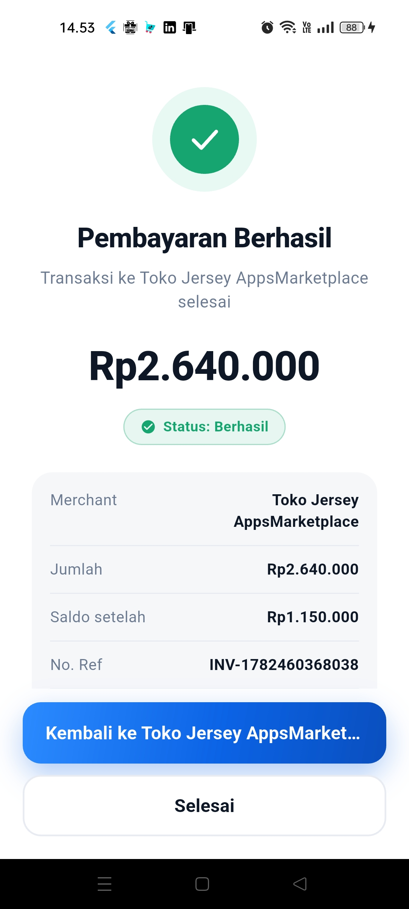_ |

### Riwayat & Akun

| Riwayat Transaksi                                                               | Halaman Promo & Berkah                                                    | Halaman Akun                                                                          |
| ------------------------------------------------------------------------------- | ------------------------------------------------------------------------- | --------------------------------------------------------------------------------- |
| _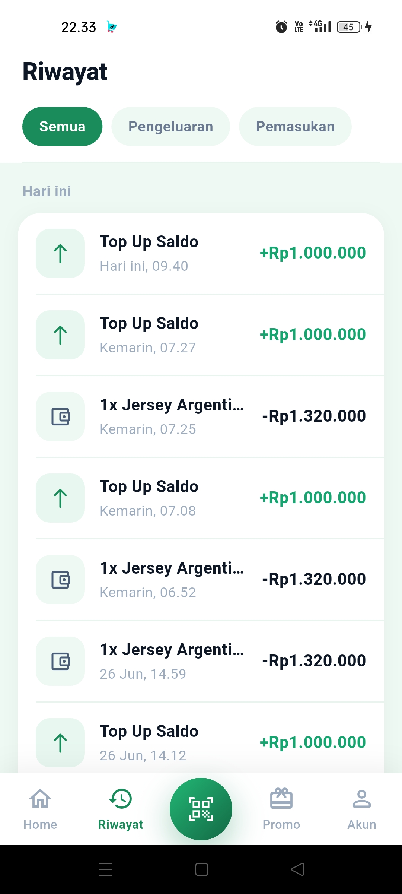_ | _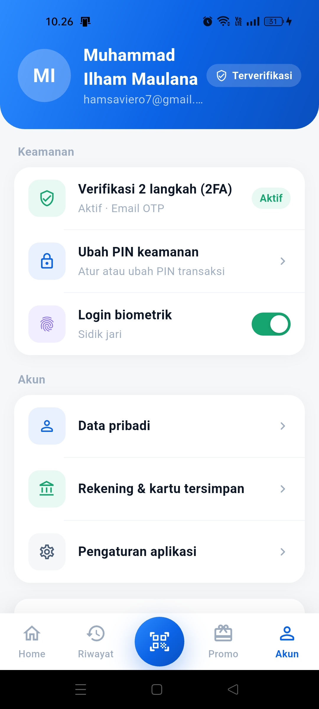_ | _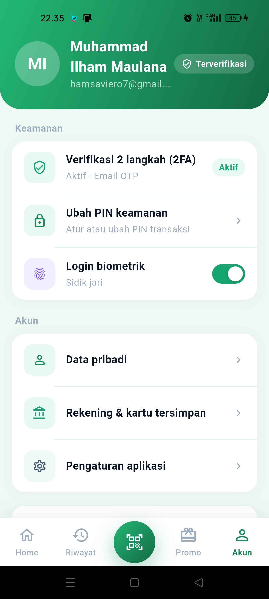_ |

---

## Link Video Presentasi

> **Video demo & presentasi aplikasi:**

🎬 **[Tonton di YouTube — [UAS Mobile] Dompet Syari'ah — Aplikasi E-Money & E-Commerce dengan Deep Link + 2FA](https://youtu.be/DfQiKn82G3s)**

---

## Implementasi Deep Link

Deep Link digunakan agar aplikasi **AppsMarketplace (E-Commerce)** bisa meminta pembayaran langsung ke **Dompet Syari'ah (E-Money)** tanpa user perlu berpindah secara manual.

### Alur Lengkap Deep Link

```
[AppsMarketplace]                        [Dompet Syari'ah]
      │                                           │
      │  1. User klik "Bayar via E-Money"         │
      │──────────────────────────────────────────▶│
      │  dompetsyariah://pay?merchant_id=X          │
      │  &merchant_name=Y&amount=Z                 │
      │  &description=D&reference=R               │
      │  &callback=appsmarketplace://result        │
      │                                           │
      │                          2. DeeplinkService._handleUri()
      │                          3. Tampil MerchantCheckoutPage
      │                          4. User input PIN → PaymentBloc
      │                          5. Backend proses transfer
      │                           │
      │  6. Callback: appsmarketplace://payment-result
      │◀──────────────────────────────────────────│
      │  ?status=success&amount=Z                  │
      │  &reference=R&transaction_id=DKGxxx        │
```

### File Kunci Deep Link

| File                                                          | Peran                                                   |
| ------------------------------------------------------------- | ------------------------------------------------------- |
| `lib/core/services/deeplink_service.dart`                     | Menangkap URI masuk, parse parameter, buffer cold-start |
| `lib/main.dart`                                               | `DeeplinkService().init()` dipanggil sebelum `runApp()` |
| `lib/presentation/pages/home/home_page.dart`                  | Menerima event deeplink, push ke `/merchant`            |
| `lib/presentation/pages/merchant/merchant_checkout_page.dart` | Tampilkan detail pesanan dari deeplink                  |
| `android/app/src/main/AndroidManifest.xml`                    | Intent filter scheme `dompetsyariah`                    |

### Skema URL Deep Link

```
# Dari E-Commerce → E-Money (permintaan bayar)
dompetsyariah://pay
  ?merchant_id=JERSEY_STORE_01
  &merchant_name=Toko%20Jersey
  &amount=2640000
  &description=1x%20Jersey%20Portugal
  &reference=INV-1782458232207
  &callback=appsmarketplace://payment-result

# Dari E-Money → E-Commerce (hasil transaksi)
appsmarketplace://payment-result
  ?status=success
  &amount=2640000
  &reference=INV-1782458232207
  &transaction_id=DKG22xxxxx
```

### Potongan Kode Inti

```dart
// lib/core/services/deeplink_service.dart
void _handleUri(Uri uri) {
  if (uri.scheme == 'dompetsyariah' && uri.host == 'pay') {
    final paymentData = DeeplinkPaymentData(
      merchantId:   uri.queryParameters['merchant_id'] ?? '',
      merchantName: uri.queryParameters['merchant_name'] ?? '',
      amount:       double.tryParse(uri.queryParameters['amount'] ?? '0') ?? 0,
      description:  uri.queryParameters['description'] ?? '',
      reference:    uri.queryParameters['reference'] ?? '',
      callbackUrl:  uri.queryParameters['callback'] ?? '',
    );
    _pendingPayment = paymentData;         // buffer cold-start
    _paymentDataController.add(paymentData); // warm-start stream
  }
}
```

---

## Implementasi Two-Factor Authentication (2FA)

Aplikasi mendukung **tiga metode 2FA** yang bisa dipilih pengguna saat setup akun.

### Metode 2FA yang Tersedia

| Metode                          | Cara Kerja                                                           | File                                                |
| ------------------------------- | -------------------------------------------------------------------- | --------------------------------------------------- |
| **SMTP (Email OTP)**            | Backend kirim kode 6 digit ke email user via SMTP                    | `lib/presentation/pages/auth/twofa_smtp_page.dart`  |
| **TOTP (Google Authenticator)** | QR code di-scan ke Google Authenticator, kode berputar tiap 30 detik | `lib/presentation/pages/auth/twofa_totp_page.dart`  |
| **Push Notification**           | Firebase Cloud Messaging (FCM) kirim notifikasi approve/deny         | `lib/presentation/pages/auth/twofa_notif_page.dart` |

### Alur 2FA saat Login

```
User input email & password
         │
         ▼
  Backend verifikasi kredensial
         │
    ┌────┴────────────────────────────────┐
    │   Metode 2FA yang terdaftar?        │
    └────┬─────────┬──────────────────────┘
         │         │              │
       SMTP      TOTP           FCM Notif
         │         │              │
   Kode email  Kode Authenticator  Approve di HP
         │         │              │
    └────┴─────────┴──────────────┘
                   │
         OTP dikirim ke backend (/v1/auth/verify-otp)
                   │
         Backend validasi → JWT Token diterbitkan
                   │
              User masuk aplikasi
```

### Potongan Kode Inti

```dart
// lib/presentation/blocs/auth/otp_bloc.dart
// Kirim kode OTP ke backend untuk diverifikasi
void _onVerifyOtp(OtpVerifyRequested event, Emitter<OtpState> emit) async {
  emit(OtpLoading());
  final result = await verifyOtp(VerifyOtpParams(
    email:   event.email,
    otpCode: event.code,
    otpType: event.otpType, // 'smtp' | 'totp' | 'notification'
  ));
  result.fold(
    (failure) => emit(OtpFailure(failure.message)),
    (token)   => emit(OtpSuccess(token)),
  );
}
```

```go
// backend/handlers/auth.go — validasi OTP di server
switch req.OtpType {
case "smtp":
    otpValid = validateSmtpOtp(req.Email, req.OtpCode)
case "totp":
    otpValid = totp.Validate(req.OtpCode, user.TotpSecret)
case "notification":
    otpValid = checkNotificationApproval(user.ID)
case "pin":
    otpValid = true  // PIN divalidasi di sisi Flutter (SecureStorage)
}
```

---

## Penjelasan Kode — Highlight Implementasi

### 1. Clean Architecture: Alur Data Payment

```
PinPage._processPayment(pin)
    │
    ▼
PaymentBloc.add(PaymentTransferRequested)          ← Presentation
    │
    ▼
PaymentTransferUseCase.call(params)                ← Domain
    │
    ▼
PaymentRepositoryImpl.transfer(amount, otp)        ← Data
    │
    ▼
PaymentRemoteDataSource.transfer()  ─── Dio HTTP ──▶ Backend /v1/payment/transfer
    │
    ▼
PaymentBloc → PaymentTransferSuccess
    │
    ▼
PinPage (BlocListener) → context.go('/success', extra: {...})
```

### 2. PIN Security — Penyimpanan Lokal Aman

PIN tidak pernah dikirim ke server dalam bentuk tersimpan. Mekanismenya:

```dart
// Simpan PIN (hanya saat user pertama kali buat)
await FlutterSecureStorage().write(key: 'security_pin', value: pin);

// Validasi PIN saat transaksi (lokal, tidak ke server)
final stored = await FlutterSecureStorage().read(key: 'security_pin');
if (pin != stored) { /* shake + error */ return; }

// Kirim ke backend hanya otp_type: 'pin' (backend percaya JWT)
PaymentTransferRequested(otpCode: pin, otpType: 'pin')
```

### 3. Logout Aman — PIN Tidak Terhapus

Masalah umum: logout menghapus semua data termasuk PIN. Solusi yang diterapkan:

```dart
// lib/data/datasources/local/secure_storage_datasource.dart
Future<void> clearAll() async {
  await Future.wait([
    _storage.delete(key: AppConstants.kJwtToken),
    _storage.delete(key: AppConstants.kUserData),
    _storage.delete(key: AppConstants.k2faMethod),
    _storage.delete(key: AppConstants.kFcmToken),
  ]);
  // AppConstants.kPin SENGAJA tidak dihapus → PIN tetap ada setelah logout
}
```

---

## Catatan Teknis

- **Minimum Android:** API 21 (Android 5.0 Lollipop)
- **Target Android:** API 34 (Android 14)
- **Deep Link Scheme:** `dompetsyariah://pay?amount=...&merchant_id=...`
- **Autentikasi:** JWT Bearer Token + 2FA opsional
- **PIN:** Disimpan lokal di `FlutterSecureStorage`, tidak dikirim ke server — backend menerima `otp_type: "pin"` selama JWT valid

---

_Institut Teknologi dan Bisnis Bina Sarana Global · 2025/2026_
